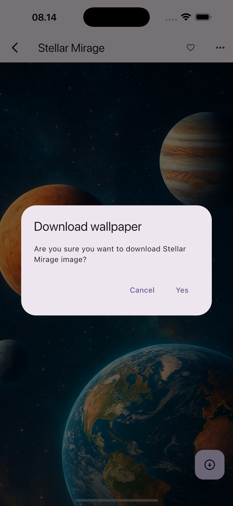
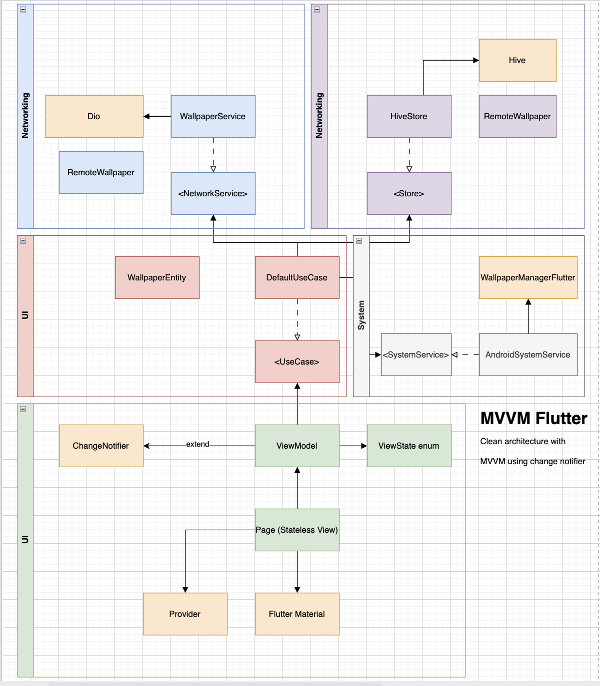

# sketra 

Sketra – Creative Backdrops for Your World

Sketra is a **wallpaper application** built with **Flutter** using the **MVVM architecture pattern**.  
It supports both **Android** and **iOS** platforms. See more detail in ([Sketra's landing page](https://arifinfrds.github.io/my-apps/sketra/index.html)).

## Features
- Cross-platform: Works on **iOS** and **Android**  
- Built with **Flutter** and **Dart**  
- **MVVM architecture** for clean separation of concerns  
- Wallpapers are **AI-generated by ChatGPT, Image Playground**  
- Images are hosted on **GitHub Pages** ([arifinfrds.github.io](https://arifinfrds.github.io))  

## Tech Stack
- **Flutter**  
- **Dart**  
- **MVVM (Model-View-ViewModel)**  
- **Change Notifier**  
- **Hive**  
- **Wallpaper Manager Flutter**  
- **Dio**  
- **GitHub Pages** (for image hosting)  

## 📱 App Screenshots

| **Feature**         | **Screenshot**         |
|---------------------|------------------------|
| Home Screen         |  |
| Detail Screen       |  |


## Proposed Architecture


## Installation
Clone this repository and run with Flutter:
```bash
git clone https://github.com/arifinfrds/sketra.git
cd sketra
flutter pub get
flutter run
